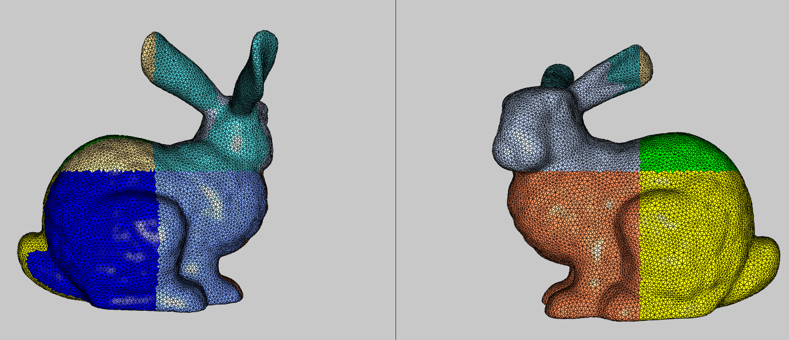
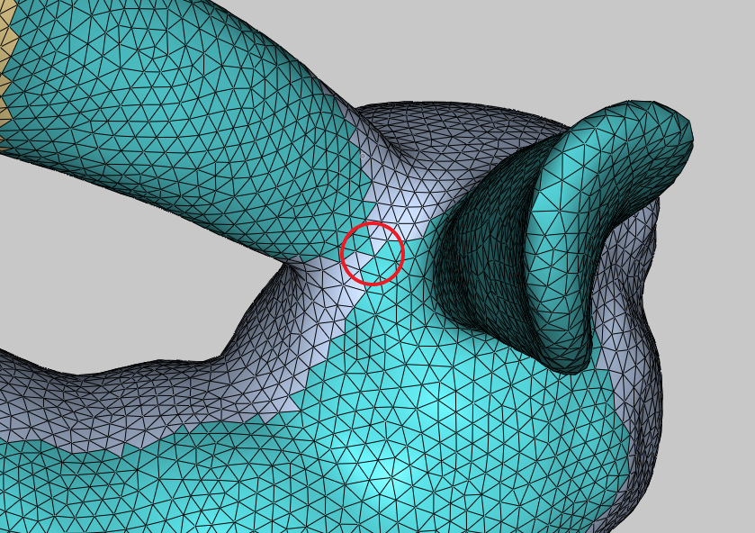
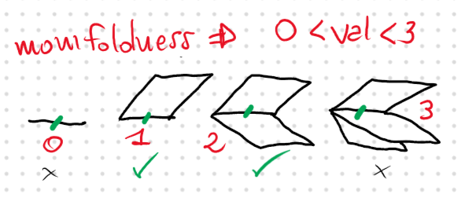
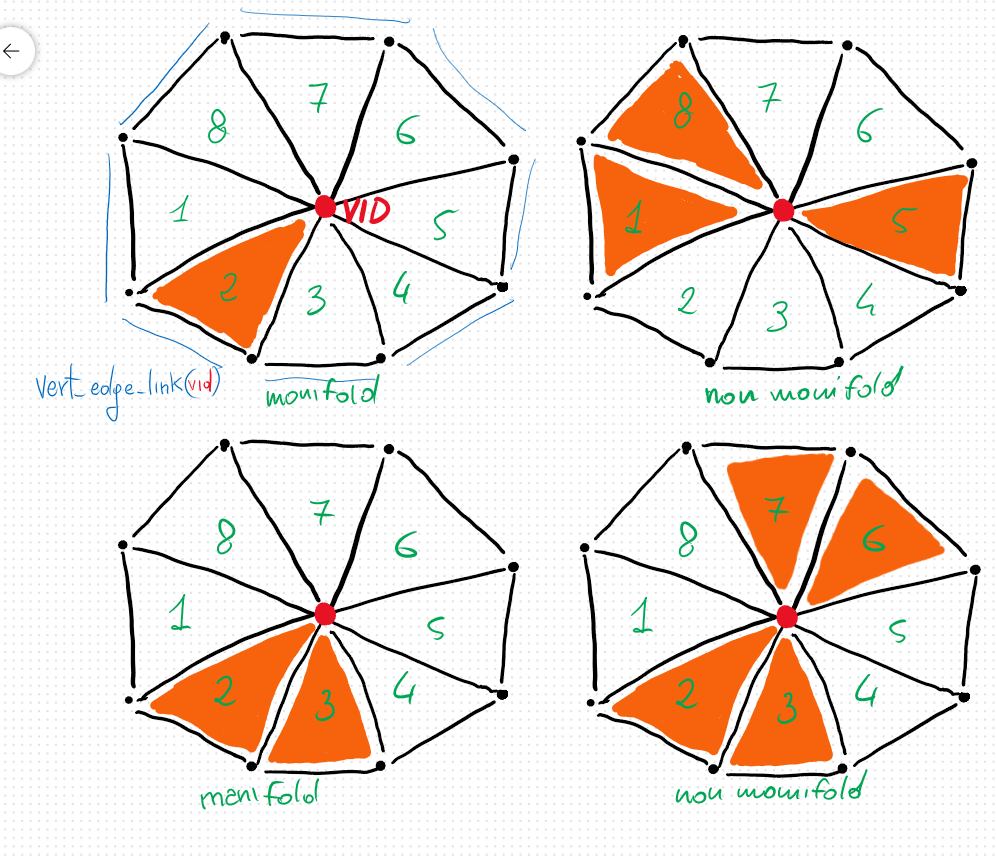
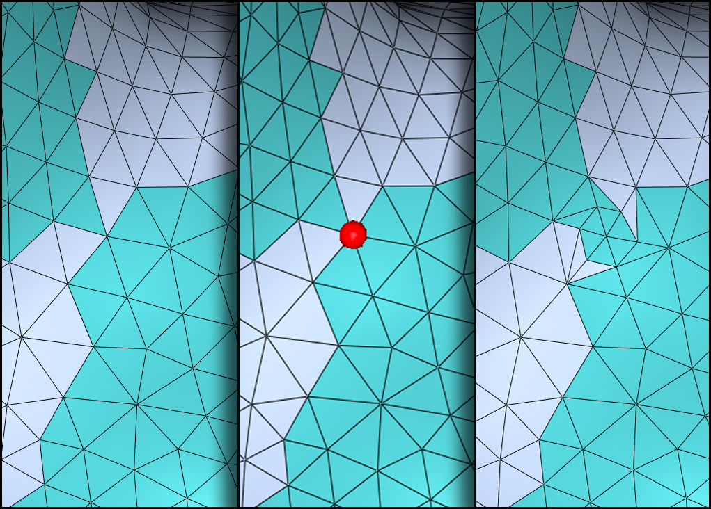
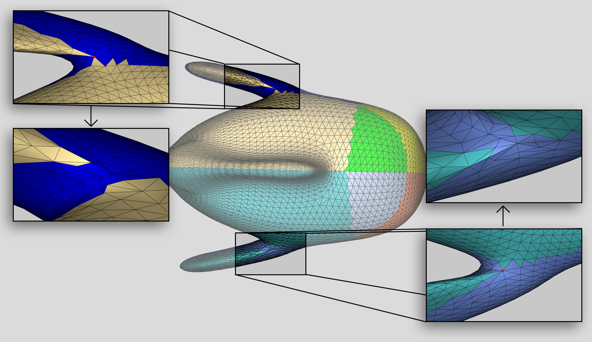
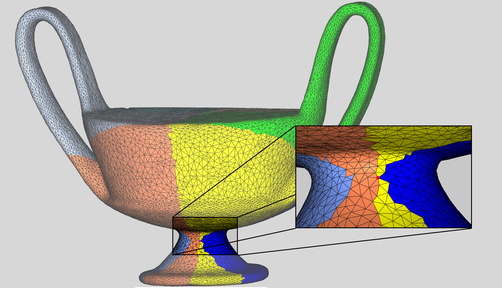
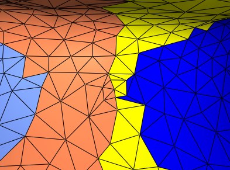

# **Internship**

## Polygon Mesh

A mesh is a set of vertices, edges and faces, saved in certain ways, according to the necessary specifications, with which it is possible to represent the surface of real objects on a digital domain.

There are both surface meshes, which represent an object only through their surface but whose interior is empty, and volume meshes, which also represent the interior.

## Transformations on Mesh

As a rule, the right hand rule as in in the image is taken into account for axis positioning.


So to rotate a mesh with respect to a point in space you can apply the transformation to all the vertices of the mesh, going to modify the coordinates of each of them.
In case the edges are explicitly determined by the vertex pairs, it will not be necessary to go to modify them 

### Scaling

### 


### Rotation

### 

### Translation

### 

**Ubuntu Work Space Setup** 

Download [Qt-Creator](https://www.qt.io/download-qt-installer?hsCtaTracking=99d9dd4f-5681-48d2-b096-470725510d34|074ddad0-fdef-4e53-8aa8-5e8a876d6ab4) + [Cinolib](https://github.com/mlivesu/cinolib):

```
sudo apt install build-essential -y
sudo apt install qtcreator -y
sudo apt install qt5-default -y
sudo apt install qt5-doc qt5-doc-html qtbase5-doc-html qtbase5-examples -y
git clone --recursive https://github.com/mlivesu/cinolib.git
```

## Cinolib library approach

All meshes inherit from the Abstract Mesh.

**Apply Rotation, Translation and Scaling to one of the examples**.

Using the '*01_base_app_trimesh*' example 
To compile comment all lines referring to vtk in the **.pro** file.
The mesh is initialized in a DrawableTrimesh and pushed onto the canvas.
Before being, to move the mesh to the point (0,0,0) we take its bbox.

## Manifold Concept

A space is n-manifold if and only if the outline at each of its points resembles a Euclidean space of the same size.

A 1-manifold space must resemble a size 1 space for each point.

## Mesh subdivision and inside cluster non-manifoldness cases identification.

The problem of non manifold topology in a cluster after the subdivision will be useful in a larger pipeline for a conversion of tetrahedral mesh to hexahedral mesh.
Manifoldness is key for a correct conversion and the subsequent reconnection of the hex mesh clusters.

### Problem workflow:

- Cluster subdivision
- Non manifold vertex identification
- Edge Split incident to the vertex
- Re apply cluster Cluster subdivision

Beginning from a tetrahedral mesh might be a little much. So let-s start with the Stanford bunny.

First step is the clusterization, and since I the bunny is a pretty triangulated mesh and not many vertices will result non manifold, I'll subdivide the mesh around the 8 spatial spaces created at the intersection of the axis.

So the mesh needs to be translated in the origin :

```c++
    m.translate( m.bbox().center() );
```


### Result of cluster subdivision around the origin point

The cluster subdivision is done in a loop over all vertices:

```c++
    double x,y,z;
    for(uint pid=0; pid < m.num_polys(); ++pid){
        x = m.poly_centroid(pid).x();
        y = m.poly_centroid(pid).y();
        z = m.poly_centroid(pid).z();
        if(x >= 0 && y >= 0 && z >= 0) m.poly_data(pid).color = Color::GREEN();
        if(x >= 0 && y >= 0 && z <= 0) m.poly_data(pid).color = Color::PASTEL_YELLOW();
        if(x >= 0 && y <= 0 && z >= 0) m.poly_data(pid).color = Color::YELLOW();
        if(x >= 0 && y <= 0 && z <= 0) m.poly_data(pid).color = Color::BLUE();
        if(x <= 0 && y >= 0 && z >= 0) m.poly_data(pid).color = Color::PASTEL_PINK();
        if(x <= 0 && y >= 0 && z <= 0) m.poly_data(pid).color = Color::PASTEL_CYAN();
        if(x <= 0 && y <= 0 && z >= 0) m.poly_data(pid).color = Color::PASTEL_ORANGE();
        if(x <= 0 && y <= 0 && z <= 0) m.poly_data(pid).color = Color::PASTEL_VIOLET();
    }
    m.updateGL(); //Always update after transforms on mesh
```




### Non Manifold vertices in same Cluster

The only position where a non manifold vertex can appear on this nicely done mesh is over the saddle surface between the ears of the bunny.
After fiddling with rotations, the job of finding a detectable case is done by the following code:

```c++
m.rotate(vec3d(0,1,0),0.001);
```




### Non manifold vertex identification

The cinolib library contains a function for detecting non manifold vertices or edges of a mesh.

```c++
bool AbstractPolygonMesh<M,V,E,P>::edge_is_manifold(const uint eid)
bool AbstractPolygonMesh<M,V,E,P>::vert_is_manifold(const uint vid)
```

#### Edge manifoldness

Edge manifoldness analysis is determined by counting how many polygons a given edge is adjacent to.

This number, called *valence*, needs to be equal to either 1 or 2 for the edge to be manifold. Otherwise the edge is a single line or there are multiples faces adjacent to it, in which case the 2-manifoldness satisfied.



In cinolib the the edge-faces adjacencies is a vector<uint> and the valence number is therefore its size.
Consequently edge manifoldness has O(1) complexity.

#### Vertex manifoldness

Analysing if vertex is manifold requires to check if every component of its edge_link is connected or not.

The function consist in a Breadth-first search over the edge_link of a vertex.

```c++
std::vector<uint> e_link = this->vert_edges_link(vid);
std::unordered_set<uint> edge_set(e_link.begin(), e_link.end());

    std::queue<uint> q;
    q.push(e_link.front());

    std::unordered_set<uint> visited;
    visited.insert(e_link.front());

    while(!q.empty())
    {
        uint curr = q.front();
        q.pop();

        assert(CONTAINS(visited, curr));

        for(uint nbr : this->adj_e2e(curr))
        {
            // still in the link of vid, but not visited yet
            if(CONTAINS(edge_set, nbr) && !CONTAINS(visited, nbr) )
            {
                visited.insert(nbr);
                q.push(nbr);
            }
        }
    }

    return (visited.size() == e_link.size());
```

If the number of visited edges corresponds to the number of edges in the edge_link, the vertex is manifold.
Vertex manifoldness detection has O(V + E) complexity.

### How to detect a non manifold vertex inside a cluster ?

This two library algorithms search over the entire mesh surface.

They will not detect the two non manifold red vertices on the right side of the image, as they are so just in relation to the orange cluster of the mesh.



On the bottom right poly star around the red vertex there's no 2d space path which can allow an ant to walk from the portion 2-3 to the 6-7.

The idea consist in iterating over each poly star around a vertex and detect if there are polys of a given colour connected only by the vertex.

The following code searches around a vertex in an ordered fashion, thanks to the *vert_ordered_polys_star(vid)* function, allowing to determine if there are disconnected same-colour polys.
Don't really like this Booleans approach but it works.

```c++
bool AbstractPolygonMesh<M,V,E,P>::vert_is_manifold(const uint vid, Color c) const
{
    for(uint eid : this->adj_v2e(vid))
    {
        if(!this->edge_is_manifold(eid)) return false;
    }

    std::vector<uint> p_star = this->vert_ordered_polys_star(vid);
    std::unordered_set<uint> edge_set(p_star.begin(), p_star.end());

    std::queue<uint> q;
    q.push(p_star.front());

    std::unordered_set<uint> visited;
    visited.insert(p_star.front());

    if(this->poly_data(q.front()).color != c){

        /// checking if the color correspond to the selected cluster
        return true;
    }

    Color curr_color = this->poly_data(q.front()).color;

    bool change1 = false;
    bool change2 = false;
    bool change3 = false;
    for(auto pid : p_star){
        if(change2){
            if(this->poly_data(pid).color != curr_color){
                change3 = true;
            }
        }
        if(change1){
            if(this->poly_data(pid).color != curr_color){
                curr_color = this->poly_data(pid).color;
                change2 = true;
            }
        }
        if(this->poly_data(pid).color != curr_color){
            curr_color = this->poly_data(pid).color;
            change1 = true;
        }
    }

    return (!change3);
}
```

This code detects non manifold vertices of a specified cluster of polygons.
 To easily detect them they are then marked with a red Drawable Sphere, and we can also iterate over the *vert_ordered_edges_star(vid)* and split them with and edge_split(vid, 0.5), where 0.5 is the distance relative the 2 vertex the edge.

In pseudocode

```pseudocode
foreach vertex in mesh
	if vid_is_manifold( vid, color )
		foreach edge_incident( vid )
			edge_split( edge_midpoint )
```

### Bunny Mesh

The result on the bunny mesh is show in these 3 steps below.



The algorithm iterates over each of the n vertices of the mesh, and for each has to check a small number of polys color. (not so sure about complexity, can depend on the mesh).

### Blub triangulated Mesh

Same algorithm works well even this Trimesh of a fish, where 2 non manifold vertex came out where the fins attach to the body.

```c++
m.translate(m.bbox().center());
m.rotate(vec3d(1,0,0),0.35);
```



### Cup Mesh

This is a dreadfully triangulated mesh that will surely allow for some non manifoldness inside a cluster.
The following snippet creates a desired interesting point to exam in the yellow cluster.

```c++
m.translate( m.bbox().center() );
m.rotate(vec3d(1,0,0),0.39);
```

Again the wanted vertex appears in a saddle portion of the mesh.



This case revealed a problem in the algorithm.

Before even iterating over the poly star I was always checking if the first poly on the list was of the colour selected, if not I simply returned from the function.

Therefore because a poly star is a unique ordered set of poly around a vertex, in the case of the bunny it was just a coincidence that the algorithm could go into the loop to check.

The case in the yellow cluster of the cup was indeed not detected by this algorithm.

A simple, but not really elegant solution is to iterate over every poly until one of desired colour is found and then start the check from there.

```c++
    for(auto pid : p_star){
        if(this->poly_data(pid).color == c){
            found_color = true;     // Cycle over p_star untill first poly of selected cluster is found
        }
        if(found_color){
            if(change2){
                if(this->poly_data(pid).color != c){
                    change3 = true;
                }
            }
            if(change1){
                if(this->poly_data(pid).color == c){
                    change2 = true;
                }
            }
            if(this->poly_data(pid).color != c){
                change1 = true;
            }
        }
    }
```

The non manifold vertex is correctly detect now and can be dealt like before by splitting the incidentals edges.

But a new problem now arises.
A new vertex became non manifold.



This is a problem easily solved by adjusting the clustering condition, but this could sometimes not be an viable option.

A second run of the algorithm might be required so adjust the vertex manifoldness.